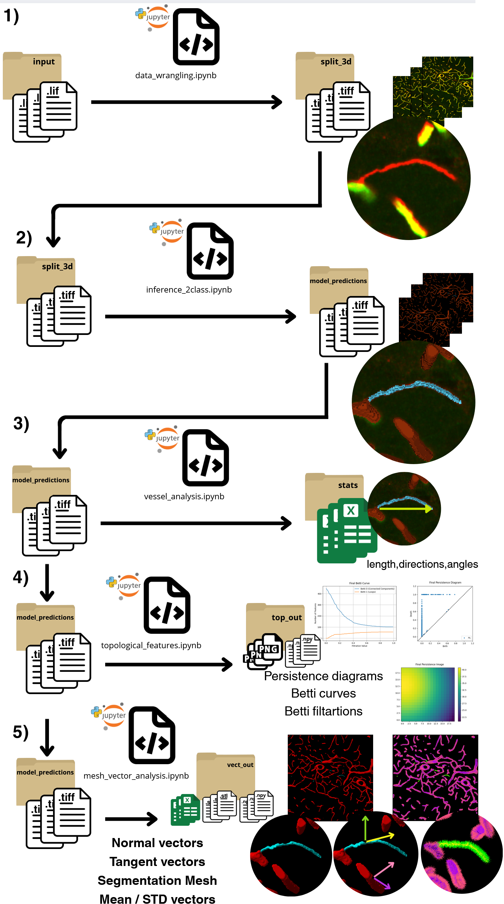

# Stirng vessel project

# How to install

* Step 1: Create and activate a new Conda environment

Create and activate a dedicated [conda](https://docs.anaconda.com/free/anaconda/install/windows/) environment for this project:

```bash
conda create -y -n stringvessel -c conda-forge python=3.11
conda activate stringvessel
```

* Step 2: Install necessary packages

Install the required packages, including the [vessel analysis](https://github.com/MMV-Lab/vessel_analysis_3d) and [im2im](https://github.com/MMV-Lab/mmv_im2im) libraries, and clone this repository:

```bash
# install vessel analysis package
pip install "vessel_analysis_3d[dev] @ git+https://github.com/MMV-Lab/vessel_analysis_3d.git"

# install im2im package
pip install "mmv_im2im[all] @ git+https://github.com/MMV-Lab/mmv_im2im.git"

# clone this repo and install other dependencies
git clone https://github.com/MMV-Lab/string_vessel_project.git
cd string_vessel_project
pip install -r requirements.txt 
```

## ⚠️ <span style="color: yellow;"> Warning </span> ⚠️

The current installation is designed to work with the latest version of [PyTorch + CUDA](https://pytorch.org/). If your computer runs on an older version, you will need to force the appropriate [installation](https://pytorch.org/get-started/locally/).

# How to Use

Execute [JupyterLab](https://jupyter.org/) on the  ```string_vessel_project``` folder:

```bash
cd string_vessel_project
jupyter lab
```

And follow the in-line instructions provided in each Jupyter notebook. The steps below provide a general overview of the workflow.

Download trained models from this [LINK](https://ambiomcloud.isas.de/index.php/s/CwcfFRt8eQ9gKWj)

## Part 1: Data Wrangling

[data_wrangling.ipynb](data_wrangling.ipynb) This script converts the original Leica files into proper TIFF files.

###  <span style="color: red;"> Note on Dimensions: </span> 

When loading the original Leica files, ```aicsimageio``` may occasionally swap the C (Channel) and Z (Depth) dimensions. For these datasets, you may need to re-order the dimensions to ensure images are in the required CZYX shape (e.g., C=2, Z=7).


## Part 2: Segmentation Inference

[inference_2class.ipynb](inference_2class.ipynb) This notebook applies the 2D model to the 3D data to generate a segmentation for each file.

The resulting segmentation uses pixel values to classify structures:

2: String vessels

1: Normal vessels

0: Background

###  <span style="color: red;"> Note: </span> 

This notebook contain some helpful instructions for testing the newly provided models.<br>

###  <span style="color: red;"> Note for Command Line Inference: </span> 

 For easier use, it is possible to run the inference using the command line.<br> Set your parameters in the provided [inference_vol_prob_example.yaml](inference_vol_prob_example.yaml) configuration file for the probabilistic model and [inference_vol_classic_example.yaml](inference_vol_classic_example.yaml) to the classic one <br>
 Execute the following: 

```bash
# Inside of the project's anaconda enviroment 
conda activate stringvessel

# Run the inference
run_im2im --config /path/to/the/inference_vol_prob/classic_example.yaml  # file with your saved configurations
```

### Inference Evaluation
[model_evaluation.ipynb](model_evaluation.ipynb) This notebook it's provided to replicate the evaluation of the model's segmentation using multiples annotations generated by different annotators, the details are within the notebook.

## Part 3: Quantitative Vessel Analysis

[vessel_analysis.ipynb](vessel_analysis.ipynb) This script extracts quantitative features from the segmentation results.


## Part 4: Topological Features Extraction

[topological_features.ipynb](topological_features.ipynb) This script extracts topological features from the segmentation results.

###  <span style="color: red;"> Important Notes: </span> 

The code used here is an adaptation of the code related to this [paper](https://arxiv.org/abs/2402.16894). You can refer to the paper for a detailed analysis.

If you want to consult detailed information about the files generated by this new analysis, please check [this report](docs/output_info.md).

## Part 5: Mesh and Vector Analysis

[mesh_vector_analysis.ipynb](mesh_vector_analysis.ipynb) This script extracts vectorial feature maps from the mesh associated with the segmentation results.

This code generates visual vector maps for the tangent and normal vectors of the segmentation, providing visual and statistical information about the orientations of the veins. It also computes the mesh associated with the segmentation, which is useful for future analysis.

<b>Visualization Setup (Step 3)</b>

For the Visualization part (Step 3) in [mesh_vector_analysis.ipynb](mesh_vector_analysis.ipynb):

If you are running the code on a machine with a graphical interface, run the whole notebook following the in-line instructions.

If you are working on a cluster or another machine without graphical resources, you can run Steps 1 and 2 for the computational part, and then follow these steps for visualization:

In your computer with graphical interface create a new enviroment:

1. Create a new environment on your computer with a graphical interface:

```bash
conda create -y -n visualizator -c conda-forge python=3.11
conda activate visualizator
```

2. Clone the repository and navigate to the folder:

```bash
git clone https://github.com/MMV-Lab/string_vessel_project.git
cd string_vessel_project
```
3. Install visualization-only requirements:
We provide the [requirements_graphs.txt](requirements_graphs.txt)  file containing only the dependencies needed for visualization. This is intended to save resources on your visualization machine.

```bash
pip install -r requirements_graphs.txt
```
4. Run visualization:

You can then run Step 3 of the  [mesh_vector_analysis.ipynb](mesh_vector_analysis.ipynb) as usual.

Alternatively, use the provided [visualizer.py](core/visualizer.py) code in the command line within this new environment:

```bash
# Inside the 'visualizator' Conda environment
conda activate visualizator

Run the visualizer
python ./string_vessel_project/core/visualizer.py --path /path/to/the/folder/with/the/.npy/files  # folder with the generated .npy files
```

# Workflow Overview


