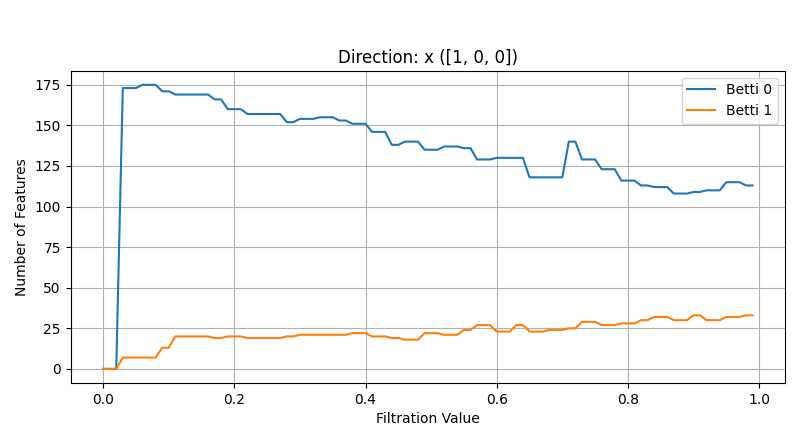
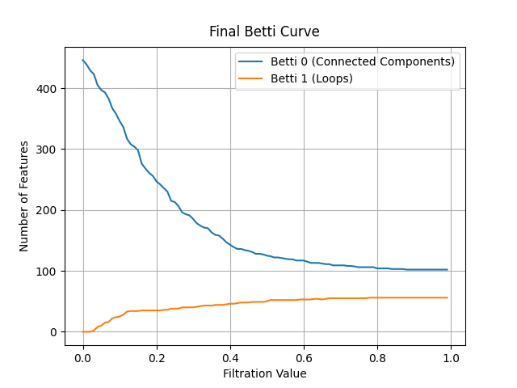
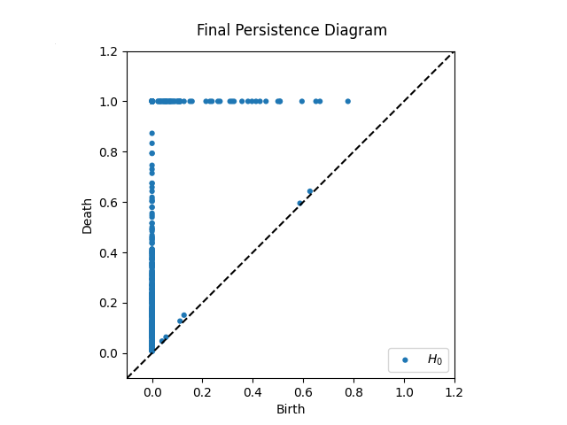
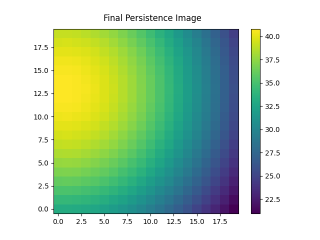
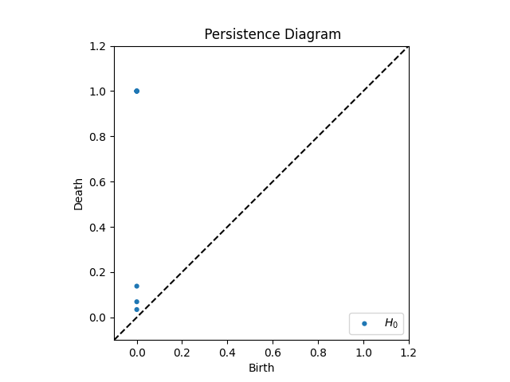
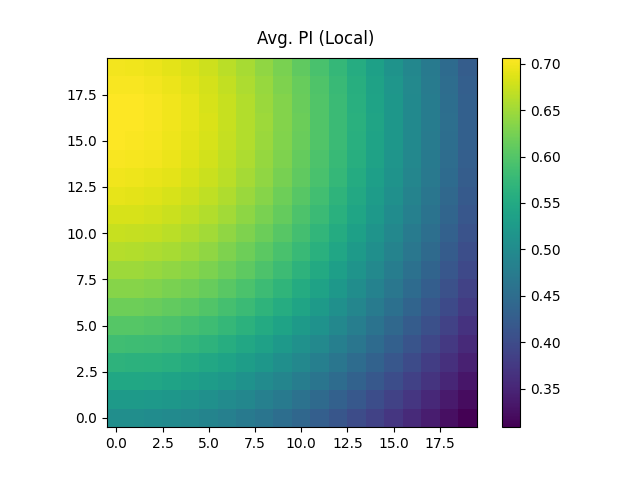

# Interpreting Output Files from Topological Feature Extraction

This report outlines how to interpret the various output files generated by the `topoextraction.py` script, which implements topological data analysis methods described in the accompanying paper "TOPOLOGICAL ANALYSIS OF MOUSE BRAIN VASCULATURE VIA 3D LIGHT-SHEET MICROSCOPY IMAGES". The script extracts topological features to analyze the morphology of brain vasculature, offering insights beyond traditional geometric features.

The output files are categorized by the type of topological feature extracted and saved as `.npy` files for numerical data and `.png` images for visualizations within the specified output directories (`TDA_out/npy_files` and `TDA_out/graphs`).

---

### 1. Betti Curve from Persistent Homology Transform (`betti_PHT`)

**Output Files:**
* `betti_filtrations.npy`: Contains concatenated Betti curves for multiple filtration directions.
* `betti_filtrations.png`: Visualizes the Betti curves for each filtration direction.

**Interpretation:**
The Betti Curve Transform (BCT) is derived from the Persistent Homology Transform (PHT). PHT applies persistent homology analysis from multiple angles, using different filtration functions based on distance from various directions (e.g., x, y, z, xy, xz, yz, xyz). Each filtration generates a Betti curve, which tracks the evolution of topological features (connected components and loops) across varying parameters, typically linked to the scale of observation.

* **Betti 0 (Connected Components):** The curve for Betti 0 shows how many disconnected parts (components) exist in the vasculature at different filtration values. As the filtration value increases, components might merge, causing the Betti 0 count to decrease.
* **Betti 1 (Loops):** The curve for Betti 1 indicates the number of "holes" or "loops" (like blood vessel rings) present at various filtration values. An increase in Betti 1 suggests a richer branching and connectivity in the vascular network, while a decrease might mean loops are closing or becoming insignificant.

By examining Betti curves from different directions, we can gain a comprehensive understanding of the 3D topological nature of the vascular network, highlighting complex geometric variations.

---

### 2. Final Betti Curve (`betti`)

**Output Files:**
* `betti_final.npy`: Contains the final Betti curve data.
* `betti_final.png`: Visualizes the final Betti curve.

**Interpretation:**
This Betti curve represents the overall topological features (connected components and loops) of the entire vessel segmentation. Unlike `betti_PHT`, which considers multiple directional filtrations, this "final" Betti curve often represents a single, aggregate topological analysis of the complete structure, potentially derived from a geodesic distance map. A higher value in the 1-dimensional Betti number generally signifies an increased number of loops within the vessel.

---

### 3. Persistence Image (`PI`)

**Output Files:**
* `pd_final_persistence_image.npy`: Contains the numerical data for the persistence image.
* `pd_final_persistence_diagram.png`: Visualizes the persistence diagram.
* `pd_final_persistence_image.png`: Visualizes the persistence image (heatmap).

**Interpretation:**
Persistence Diagrams (PDs) are central to persistent homology, illustrating the "birth" and "death" times of topological features. Each point in a persistence diagram corresponds to a topological feature, with its coordinates representing the filtration values at which the feature appears (birth) and disappears (death). Points further from the $y=x$ line indicate more "persistent" or enduring features.

The Persistence Image (PI) is a vectorized representation of the persistence diagram. It transforms the multi-point nature of PDs into a fixed-size image (heatmap), making them more suitable for machine learning applications. The intensity in different regions of the PI heatmap reflects the "importance" or "density" of topological features with specific birth-death characteristics.

**Heatmap Color Interpretation:**
* **Hotter colors (e.g., red, yellow)** indicate a **higher concentration or density of topological features** with similar birth and persistence values. These are "hot spots" of significant features.
* **Cooler colors (e.g., blue, green)** indicate **fewer or less prominent topological features** in that region of the diagram. The intensity of the color reflects the "weight" or "contribution" of the features.

---

### 4. Patchwise Persistence Image (`PI_local`)

**Output Files:**
* `pi_local_persistence_diagram.npy`: Contains the numerical data for the averaged persistence images from patches.
* `pi_local_avg.png`: Visualizes the averaged persistence image (heatmap) across all patches.
* `patch_graphs/pi_local_persistence_diagram_tile_n.png`: (Optional, if `plot_per_patch` is true) Individual persistence diagrams for each tile/patch.

**Interpretation:**
This feature performs a local topological analysis by dividing the 3D image into smaller tiles or patches. For each non-empty tile, a persistence diagram is computed, and subsequently, a persistence image. The `pi_local_avg.png` then displays the average of these persistence images across all patches of a given brain region.

* **Individual Patch Persistence Diagrams (`pi_local_persistence_diagram_tile_n.png`):** If generated, these show the birth-death pairs of topological features within specific sub-regions of the vasculature. This allows for the study of local variations in vascular topology.
* **Averaged Persistence Image (`pi_local_avg.png`):** By averaging the persistence images from multiple patches, this heatmap provides a summarized view of the typical topological features found across the entire segmented vessel network. This can reveal common topological patterns or highlight regions with more complex or less complex structures.

**Heatmap Color Interpretation:**
* **Hotter colors (e.g., red, yellow)** indicate a **higher average concentration or density of topological features** across the patches for those specific birth and persistence values. These show common, significant features found repeatedly.
* **Cooler colors (e.g., blue, green)** suggest **fewer or less commonly occurring topological features** when averaged across patches. The intensity of the color reflects the average "weight" or "contribution" of features in that region.

This patch-wise approach can capture local structural nuances that might be obscured in a global analysis of the entire vasculature.

